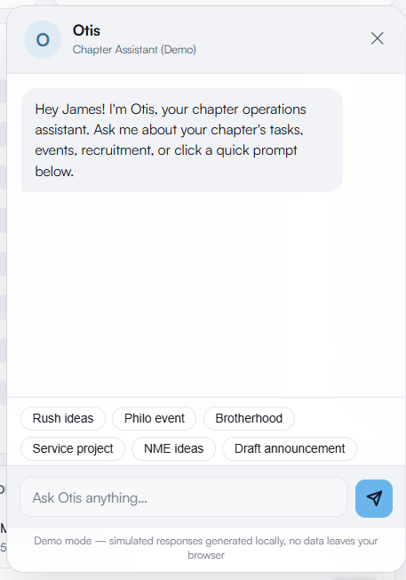

# OpsCore — Chapter Operations Platform


**OpsCore** is a full-stack chapter management system built for Greek-letter organizations. It covers every operational domain a chapter runs — from attendance and finance to recruitment CRM, judicial cases, and officer succession — in a single role-aware SPA. Built after identifying real pain points managing a 160-member chapter on spreadsheets and email threads.

**[Live Demo →](https://ops-core-sand.vercel.app/)** · No login required · All data is fictional seed data

---

## 23 Operational Modules

| Module | What it does |
|---|---|
| **Dashboard** | Chapter Health Score (0–100), KPI ring, upcoming events, overdue tasks, active alerts, attendance risk list |
| **Attendance** | Per-event tracking, semester average, class-year breakdown, warning threshold alerts, trend chart |
| **Calendar** | Month/week view, event creation with RSVP & mandatory flags, sober driver scheduling |
| **Tasks** | Kanban + list view, priority levels, assignee, due dates, completion tracking, CSV import |
| **Notes** | Structured meeting minutes with officer reports, announcements, old/new business, weekly honors; branded PDF export |
| **Finance** | Dues ledger, expense log, budget tracking, fine management, income/expense P&L, 7-tab layout |
| **Recruitment CRM** | Rushee pipeline (prospect → bid → pledge), funnel chart, stage conversion rates, rush event schedule |
| **Judicial Board** | Case management, member lookup, hearing scheduling, outcome logging, case status tracking |
| **Social Event Safety** | Sober driver shift scheduling, shift status, event coverage overview, CSV import |
| **Members** | Full roster with GPA, class year, status, role, contact info, engagement score, mobile card view, CSV import (add or bulk-update by name match) |
| **Academics** | GPA distribution, chapter average, scholarship tracking, academic warning list, CSV grade import — hard-gated to authorized roles |
| **Committees** | Committee roster, chair assignment, member selection, active project tracking |
| **Analytics** | Engagement scoring, officer performance, event trend analysis, risk distribution charts |
| **Philanthropy** | Service hours log, fundraising tracker, event management, by-member hour reporting |
| **Alumni Relations** | Alumni directory, engagement tracking, mentorship connections, outreach log |
| **Ritual & Education** | New member education program (weekly milestones by category, required-item tracking), per-member progress against required items, session scheduling, ceremony/ritual resource tracking |
| **Health Score** | Composite chapter health (attendance 30%, finance 25%, academics 20%, engagement 15%, risk 10%) |
| **Transition Hub** | Role handoff docs for all 15 officer positions — responsibilities, recurring tasks, key contacts, "wish I knew" notes |
| **Reports** | Exportable summaries: semester report, officer report, financial summary, attendance report |
| **Files** | Document storage by category, upload simulation, folder view |
| **Settings** | Chapter profile, notification preferences, academic year configuration |
| **House Management** | Weekly meal-prep crew schedule (lunch/dinner slot assignment), 29-item chore checklist across 7 house areas with day-specific recurrence, admin chore manager |
| **Otis AI Assistant** | Simulated chapter-ops chatbot — event brainstorming, task/event/finance/academics summaries, draft announcements; fully local with canned, keyword-matched responses |

CSV import (Members, Academics, Tasks, Social Event Safety) parses the file entirely in the browser and merges rows into the in-memory demo dataset — nothing is uploaded anywhere, and nothing survives a page refresh, consistent with the rest of this demo.

> **Not in this demo:** platform-level, multi-chapter administration (provisioning new chapters, cross-chapter officer approval). That capability exists in the production system this demo is based on, but is intentionally out of scope here since OpsCore demonstrates a single chapter's operations, not platform administration.

---

## Role-Based Access Control

RBAC operates on two layers: **page access** (which modules appear in the sidebar) and **edit access** (which actions render within a page). Both layers update live when switching roles in the demo banner.

### Page Access

All 15 officer roles share a common **exec base** — Dashboard, Calendar, Tasks, Files, Settings, Analytics, Reports, Health Score, Transition Hub, Notes, Sober, Attendance, Members, and Committees. Specialized modules are additive:

| Role | Additional Access |
|---|---|
| President / Vice President | All 23 modules |
| Treasurer | Finance |
| Risk Manager | Academics |
| Scholarship Chair | Academics |
| Recruitment Chair | Recruitment CRM |
| Chaplain / New Member Educator | Ritual & Education |
| Philanthropy Chair / Community Service | Philanthropy & Service |
| Alumni Relations Chair | Alumni Relations |
| House Manager | House Management (edit access) |
| Secretary / Social Chair / Public Relations | Exec base only |

All roles also see House Management (view-only for most; edit access limited per below), since it's an operational reference tool rather than officer-specific data.

### Edit Access (within-page RBAC)

Having view access to a page doesn't mean full write access. Add/edit/delete controls are conditionally rendered based on role:

| Feature | Who can add / edit / delete |
|---|---|
| Meeting Notes | President, Vice President, Secretary |
| Social Monitor Shifts | President, Vice President, Risk Manager |
| Attendance | President, Vice President, Secretary |
| Members & Committees | President, Vice President, Secretary |
| Academics (view) | President, Vice President, Scholarship Chair, Risk Manager |
| Finance | President, Vice President, Treasurer |
| Judicial Board | President, Vice President + authorized emails |
| House Management (schedule, chores, chore manager) | President, Vice President, House Manager |

All others can **view** but not modify. Edit buttons, import controls, and add actions are hidden — not just disabled.

---

## Demo vs. Production

> **What you're seeing is a fully client-side demo.** All data is fictional seed data loaded in-memory — no login required, nothing is persisted, and no Firebase calls are made.
>
> The production system replaces the demo stub with a live Firebase backend: **Firestore** for real-time document storage and **Firebase Authentication** for identity. RBAC is enforced server-side — role assignments live in Firestore `users/{uid}` documents and are read on login, so no client-side role can be spoofed. The offline cache (localStorage) syncs back to Firestore when connectivity is restored.
>
> **Otis AI is simulated in this demo.** In production, Otis calls a live backend AI service for real generated responses. Here, every reply comes from local keyword-matched templates running entirely in the browser — no API calls, no AI backend, no data ever leaves the page.

---

## Demo Data

The demo auto-logs in as **James Mitchell, President** with a complete seed dataset:

- **18 members** — names, class years, GPAs, roles, contact info, dues status, attendance history
- **14 events** — 6 past mandatory events with per-member attendance records, 8 upcoming
- **12 tasks** — mix of open, in-progress, overdue, and completed across multiple assignees
- **Finance** — dues for all 18 members, 7 expenses, budget allocations, payment history, 2 outstanding fines
- **14 rushees** — across 5 funnel stages with bid scores, recruiter assignments, and 5 rush events
- **Judicial cases** — 3 cases (2 active, 1 resolved) with case types, status, and member lookup
- **5 social monitor shifts** — across upcoming events, one unassigned to show coverage alerts
- **4 committees** — with chairs and member rosters
- **Philanthropy** — 3 events, hours logged per member, funds raised
- **5 alumni contacts** — with engagement status, outreach log, and upcoming alumni event
- **15 transition hub entries** — handoff docs for all officer positions, with role-specific content and key contacts
- **3 meeting notes** — structured chapter minutes with officer reports, honors, and action items
- **New member education program** — 12 milestones across 5 categories (58% chapter-wide complete), 4 scheduled/past sessions, and per-member progress tracking for 6 new members
- **House Management** — weekly meal-prep crew schedule across 7 live-in members, 29 default chores across 7 house areas with seeded weekly check-ins

---

## Tech Stack

| Layer | Technology |
|---|---|
| Frontend | Vanilla JS (ES6+), HTML5, CSS3 |
| Icons | Tabler Icons |
| Charts | Chart.js 4.4.3 |
| Database | Firebase Firestore (stubbed in demo; live in production) |
| Auth | Firebase Authentication + custom RBAC layer |
| Hosting | Vercel (demo) · Firebase Hosting (production) |
| Data Layer | LocalStorage offline cache + Firestore real-time sync |
| Architecture | Single-page app, 23 modules, no build step |

No npm, no build tools, no framework. Loads instantly from a single `index.html`.

---

## Skills Demonstrated

- **System design** — 23-module SPA built around a single `D{}` global data store with modular render functions and a debounced batched save layer
- **Role-based access control** — 15 role types with two-layer RBAC: page whitelists drive sidebar visibility, and per-feature `canEdit()` guards drive in-page button rendering and write protection
- **Data modeling** — members, events, attendance, finance, judicial, and recruitment all relationally linked by member ID; no ORM, pure object references
- **Data import & validation** — client-side CSV parsing with fuzzy column-name matching, add/update merge logic against the existing roster, and a pre-commit preview across Members, Academics, and Tasks
- **Firebase integration** — Firestore real-time sync, Firebase Auth, stub/override pattern for offline and demo modes
- **Data visualization** — Chart.js bar, donut, line, and radar charts across 8+ modules with dynamic data binding
- **UX engineering** — skeleton loaders, toast notifications, confirm dialogs, modal CRUD forms, keyboard shortcuts, mobile-responsive layout, offline detection banner

---

## Screenshots

| Dashboard | Attendance | Recruitment | Otis AI |
|---|---|---|---|
|  |  |  |  |

---

## Run Locally

```
git clone https://github.com/mattabe212400/OpsCore.git
cd OpsCore
open index.html   # no server needed — opens directly in any browser
```

The demo auto-authenticates as President on load. Use the **role switcher** in the blue banner to explore all 15 officer roles and see both sidebar access and in-page edit controls update in real time.
