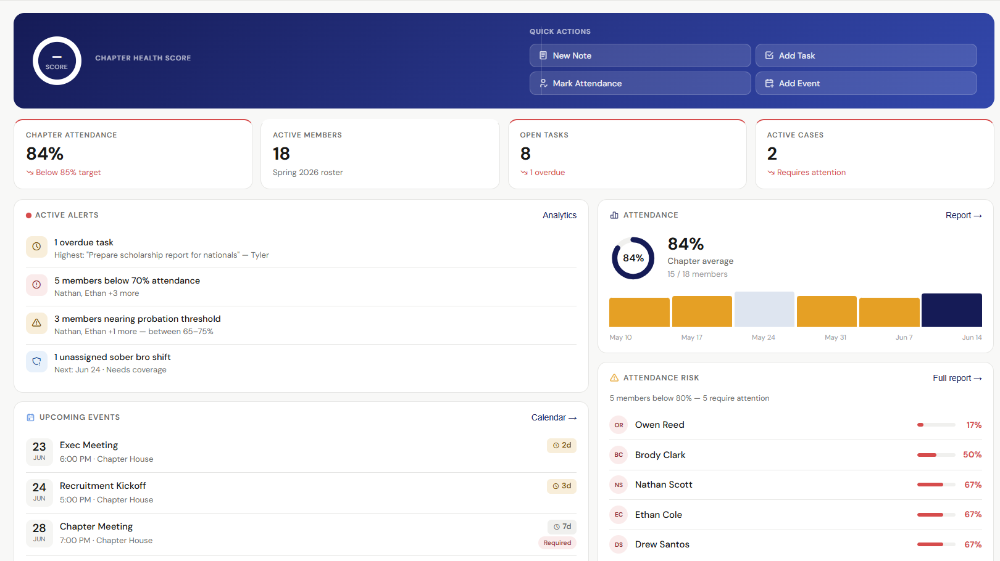
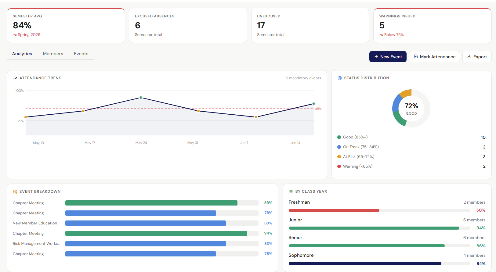
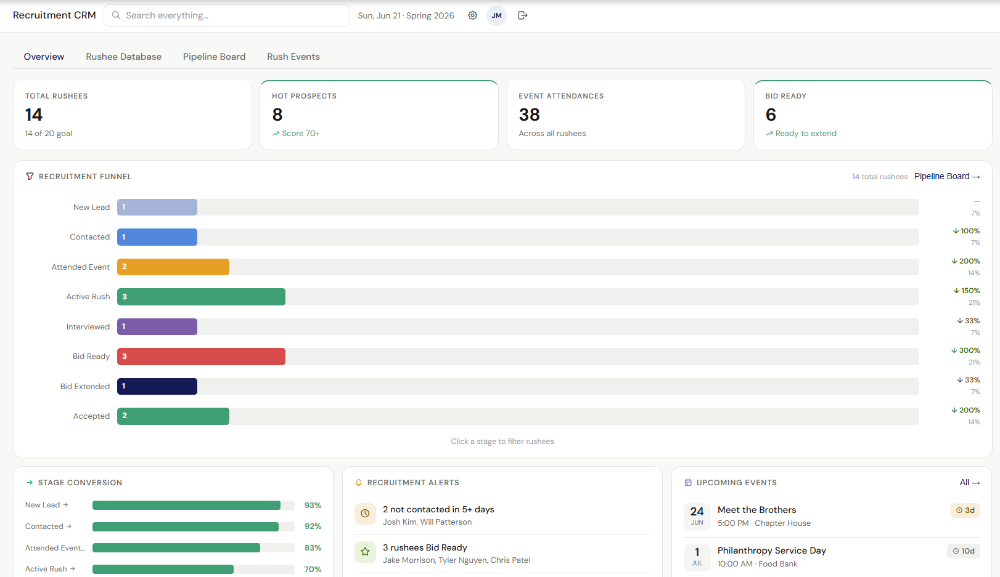

# OpsCore — Chapter Operations Platform



**OpsCore** is a full-stack chapter management system built for Greek-letter organizations. It covers every operational domain a chapter runs — from attendance and finance to recruitment CRM, judicial cases, and succession planning — in a single role-aware SPA. Built after identifying real pain points managing a 160-member chapter on spreadsheets and email threads.

**[Live Demo →](https://opscore.vercel.app)** · No login required · All data is fictional seed data

---

## 21 Operational Modules

| Module | What it does |
|---|---|
| **Dashboard** | Chapter Health Score (0–100), KPI ring, upcoming events, overdue tasks, active alerts, attendance risk list |
| **Attendance** | Per-event tracking, semester average, class-year breakdown, warning threshold alerts, trend chart |
| **Calendar** | Month/week view, event creation with RSVP & mandatory flags, sober driver scheduling |
| **Tasks** | Kanban + list view, priority levels, assignee, due dates, completion tracking |
| **Notes** | Meeting minutes with chapter, date, attendees; rich-text body; version history |
| **Finance** | Dues ledger, expense log, budget tracking, fine management, income/expense P&L, 7-tab layout |
| **Recruitment CRM** | Rushee pipeline (prospect → bid → pledge), funnel chart, stage conversion rates, rush event schedule |
| **Judicial Board** | Case management, member lookup, hearing scheduling, outcome logging, case status tracking |
| **Sober Safety** | Sober driver shift scheduling, shift status, event coverage overview |
| **Members** | Full roster with GPA, class year, status, role, contact info, member detail drawer |
| **Academics** | GPA distribution, chapter average, scholarship tracking, academic warning list |
| **Committees** | Committee roster, chair assignment, meeting notes, active project tracking |
| **Analytics** | Engagement scoring, officer performance, event trend analysis, risk distribution charts |
| **Philanthropy** | Service hours log, fundraising tracker, event management, by-member hour reporting |
| **Alumni Relations** | Alumni directory, engagement tracking, mentorship connections, contact management |
| **Ritual** | Ceremony planning, ritual resource library, schedule management |
| **Health Score** | Composite chapter health (attendance 30%, finance 25%, academics 20%, engagement 15%, risk 10%) |
| **Transition Hub** | Role handoff checklists for 8 officer positions, document library, transition timeline |
| **Reports** | Exportable summaries: semester report, officer report, financial summary, attendance report |
| **Files** | Document storage by category, upload simulation, folder view |
| **Settings** | Chapter profile, notification preferences, academic year configuration |

---

## Role-Based Access Control

12 role types, each with a curated page whitelist. Recruiters can switch roles live in the demo banner.

| Role | Access |
|---|---|
| President / Vice President | All 21 modules |
| Treasurer | Dashboard, Finance, Tasks, Analytics, Reports |
| Secretary | Dashboard, Notes, Attendance, Calendar, Reports |
| Recruitment Chair | Dashboard, Recruitment, Calendar, Members, Committees |
| Scholarship Chair | Dashboard, Academics, Members, Analytics, Reports |
| Risk Manager | Dashboard, Sober, Calendar, Analytics |
| Chaplain | Dashboard, Ritual, Members, Committees |
| Philanthropy Chair | Dashboard, Philanthropy, Committees, Calendar |
| Alumni Relations Chair | Dashboard, Alumni, Members |
| New Member Educator | Dashboard, Ritual, Members, Committees, Calendar |
| Social Chair | Dashboard, Sober, Calendar |
| Viewer | Dashboard, Attendance, Calendar, Analytics |

---

## Demo Data

The demo auto-logs in as **James Mitchell, President** with a complete seed dataset:

- **18 members** — names, class years, GPAs, roles, contact info, dues status
- **14 events** — 6 past mandatory events with per-member attendance, 8 upcoming
- **12 tasks** — mix of open, in-progress, overdue, completed
- **Finance** — dues for all 18 members, 7 expenses, budget allocations, 2 outstanding fines
- **14 rushees** — across 5 funnel stages, 5 rush events
- **Judicial cases** — 3 active cases with case types, status, and accused members
- **5 sober shifts** — across upcoming events
- **4 committees** — with chairs and member rosters
- **Philanthropy** — 3 events, hours logged, funds raised
- **5 alumni contacts** — with engagement status
- **Transition hub** — handoff checklists for 8 positions
- **Meeting notes** — 3 chapter meeting minutes

---

## Tech Stack

| Layer | Technology |
|---|---|
| Frontend | Vanilla JS (ES6+), HTML5, CSS3 |
| Charts | Chart.js 4.4.3 |
| Database | Firebase Firestore (stubbed in demo; live integration in production) |
| Auth | Firebase Authentication + custom RBAC layer |
| Hosting | Vercel (demo) · Firebase Hosting (production) |
| Data Layer | LocalStorage offline cache + Firestore real-time sync |
| Architecture | Single-page app, 21 page modules loaded on demand |

No npm, no build tools, no framework. Loads instantly from a single `index.html`.

---

## Skills Demonstrated

- **System design** — 21-module SPA architected around a single `D{}` global data store with modular render functions
- **Role-based access control** — 12 role types, each mapping to a page whitelist; sidebar dynamically reflects active role
- **Data modeling** — members, events, attendance, finance, judicial, recruitment all relationally linked by member ID
- **Firebase integration** — Firestore real-time sync, Firebase Auth, stub pattern for offline/demo mode
- **Data visualization** — Chart.js bar, donut, line, and radar charts across 8+ modules
- **UX engineering** — skeleton loaders, toast notifications, modal CRUD forms, keyboard shortcuts, responsive layout

---

## Screenshots

| Dashboard | Attendance | Recruitment |
|---|---|---|
|  |  |  |

---

## Run Locally

```
git clone https://github.com/your-username/opscore.git
cd opscore
open index.html   # no server needed — opens directly in any browser
```

The demo auto-authenticates as President on load. Use the **role switcher** in the blue banner to explore different access levels.

---

## Resume Bullets

> **Built OpsCore**, a 21-module chapter management SPA in vanilla JS + Firebase; implemented role-based access control across 12 officer types, Chart.js analytics dashboards, and a real-time Firestore data layer with offline cache fallback

> **Designed the data architecture** for a chapter operations platform tracking attendance, finance, recruitment (14-rushee CRM funnel), judicial cases, and academic performance for 18+ members, with a composite Chapter Health Score algorithm across 5 weighted dimensions
